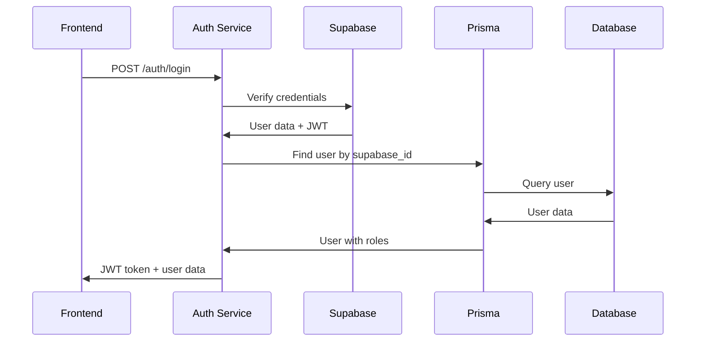

# 📦 Phase 1 - Khởi tạo hệ thống + Auth - Detailed Documentation

> **Status**: ✅ Completed  
> **Duration**: Initial setup + Authentication system  
> **Focus**: Backend foundation + Frontend architecture

---

## 🎯 Tổng quan Phase 1

Phase 1 tập trung vào việc thiết lập nền tảng cơ bản cho hệ thống OCX Online Ticket, bao gồm:
- **Backend**: NestJS framework với Prisma ORM
- **Database**: Supabase PostgreSQL integration
- **Authentication**: Supabase Auth + JWT middleware
- **Frontend**: Modular architecture với responsive design

---

## 🏗️ Backend Architecture

### 1. **Project Structure**
```
src/
├── auth/               # Authentication module
│   ├── auth.controller.ts
│   ├── auth.service.ts
│   ├── auth.module.ts
│   ├── strategies/
│   │   └── jwt.strategy.ts
│   └── dto/
│       └── auth.dto.ts
├── users/              # User management
│   ├── users.controller.ts
│   ├── users.service.ts
│   ├── users.module.ts
│   └── dto/
│       └── user.dto.ts
├── common/             # Shared components
│   ├── guards/
│   │   └── jwt-auth.guard.ts
│   ├── prisma/
│   │   ├── prisma.module.ts
│   │   └── prisma.service.ts
│   └── supabase/
│       ├── supabase.module.ts
│       └── supabase.service.ts
├── config/             # Configuration
│   ├── database.config.ts
│   ├── jwt.config.ts
│   └── supabase.config.ts
└── main.ts
```

### 2. **Database Schema (Prisma)**
```prisma
model User {
  id           String   @id @default(cuid())
  supabase_id  String   @unique
  email        String   @unique
  name         String?
  phone        String?
  role         Role     @default(USER)
  is_verified  Boolean  @default(false)
  created_at   DateTime @default(now())
  updated_at   DateTime @updatedAt
  
  // Relations
  userOrganizations UserOrganization[]
}

model UserOrganization {
  id             String @id @default(cuid())
  user_id        String
  organization_id String
  role           Role   @default(USER)
  created_at     DateTime @default(now())
  
  // Relations
  user           User @relation(fields: [user_id], references: [id])
  organization   Organization @relation(fields: [organization_id], references: [id])
}

enum Role {
  USER
  ADMIN_ORGANIZER
  OWNER_ORGANIZER
  ADMIN
  SUPERADMIN
}
```

### 3. **Authentication Flow**


---

## 🎨 Frontend Architecture

### 1. **Modular JavaScript Structure**
```
public/js/
├── app.js              # Main app (index.html)
├── i18n.js             # Internationalization
└── modules/
    ├── auth.js         # Login/Register
    ├── dashboard.js    # Dashboard
    ├── admin.js        # Common admin functions
    └── admin_manage_*.js # Specific admin modules
```

### 2. **Page Structure**
```
public/
├── index.html          # Home page (simple welcome)
├── pages/
│   ├── login.html      # Login page
│   ├── register.html   # Register page
│   ├── dashboard.html  # Admin dashboard
│   └── admin_manage_*.html # Admin management pages
└── styles/
    └── main.css        # Custom CSS
```

### 3. **Component Architecture**

#### **Auth Module** (`auth.js`)
```javascript
class AuthModule {
    constructor() {
        this.apiBaseUrl = 'http://localhost:3000/api';
        this.token = localStorage.getItem('ocx_token');
    }
    
    async handleLogin(e) {
        // Login logic
    }
    
    async handleRegister(e) {
        // Register logic
    }
    
    checkAuth() {
        // Check authentication status
    }
}
```

#### **Dashboard Module** (`dashboard.js`)
```javascript
class DashboardModule {
    constructor() {
        this.apiBaseUrl = 'http://localhost:3000/api';
        this.token = localStorage.getItem('ocx_token');
    }
    
    async loadDashboard() {
        // Load dashboard statistics
    }
    
    setupUserDropdown() {
        // User dropdown functionality
    }
}
```

#### **Admin Module** (`admin.js`)
```javascript
class AdminModule {
    constructor() {
        this.apiBaseUrl = 'http://localhost:3000/api';
        this.token = localStorage.getItem('ocx_token');
    }
    
    checkAdminAccess() {
        // Check admin permissions
    }
    
    navigateTo(url) {
        // Navigation between pages
    }
}
```

---

## 🌐 API Endpoints

### 1. **Authentication**
```typescript
// POST /api/auth/login
interface LoginDto {
  email: string;
  password: string;
}

// POST /api/auth/register
interface RegisterDto {
  name: string;
  email: string;
  password: string;
  phone?: string;
}
```

### 2. **Users Management**
```typescript
// GET /api/users
// GET /api/users/count
// POST /api/users
// PUT /api/users/:id
// DELETE /api/users/:id
```

### 3. **Dashboard Statistics**
```typescript
// GET /api/users/count
// GET /api/events/count
// GET /api/tickets/count
// GET /api/payments/revenue
```

---

## 🔐 Security Implementation

### 1. **JWT Strategy**
```typescript
@Injectable()
export class JwtStrategy extends PassportStrategy(Strategy) {
  constructor(private prisma: PrismaService) {
    super({
      jwtFromRequest: ExtractJwt.fromAuthHeaderAsBearerToken(),
      ignoreExpiration: false,
      secretOrKey: process.env.JWT_SECRET,
    });
  }

  async validate(payload: any) {
    const user = await this.prisma.user.findUnique({
      where: { supabase_id: payload.sub },
      include: { userOrganizations: true }
    });
    return user;
  }
}
```

### 2. **Role-based Access Control**
```typescript
@Injectable()
export class JwtAuthGuard implements CanActivate {
  canActivate(context: ExecutionContext): boolean {
    const request = context.switchToHttp().getRequest();
    const user = request.user;
    
    // Check admin access
    return user && (user.role === 'ADMIN' || user.role === 'SUPERADMIN');
  }
}
```

---

## 🌍 Internationalization (i18n)

### 1. **Language Support**
- **English** (default)
- **Vietnamese** (vi)

### 2. **Implementation**
```javascript
class I18n {
    constructor() {
        this.currentLanguage = localStorage.getItem('ocx_language') || 'en';
        this.translations = {
            en: { /* English translations */ },
            vi: { /* Vietnamese translations */ }
        };
    }
    
    t(key) {
        return this.translations[this.currentLanguage]?.[key] || key;
    }
}
```

### 3. **Usage in HTML**
```html
<span data-i18n="login">Login</span>
<button data-i18n="register">Register</button>
```

---

## 📱 Responsive Design

### 1. **Mobile-First Approach**
```css
/* Mobile sidebar */
@media (max-width: 768px) {
    .sidebar {
        transform: translateX(-100%);
        position: fixed;
        z-index: 50;
    }
    
    .sidebar.open {
        transform: translateX(0);
    }
}
```

### 2. **Hamburger Menu**
```html
<button id="mobile-menu-btn" class="md:hidden">
    <i class="ti ti-menu"></i>
</button>
```

### 3. **Breakpoints**
- **Mobile**: < 768px
- **Tablet**: 768px - 1024px
- **Desktop**: > 1024px

---

## 🧪 Testing Strategy

### 1. **Backend Testing**
```typescript
// auth.service.spec.ts
describe('AuthService', () => {
  it('should validate user credentials', async () => {
    // Test login functionality
  });
  
  it('should create new user', async () => {
    // Test registration functionality
  });
});
```

### 2. **Frontend Testing**
```javascript
// Manual testing checklist
- [ ] Login functionality
- [ ] Register functionality
- [ ] Dashboard loading
- [ ] Mobile responsiveness
- [ ] Language switching
- [ ] Navigation between pages
```

---

## 🚀 Deployment

### 1. **Environment Variables**
```env
# Database
DATABASE_URL="postgresql://..."

# JWT
JWT_SECRET="your-secret-key"
JWT_EXPIRES_IN="7d"

# Supabase
SUPABASE_URL="https://your-project.supabase.co"
SUPABASE_SERVICE_KEY="your-service-key"
```

### 2. **Build Process**
```bash
# Install dependencies
npm install

# Generate Prisma client
npx prisma generate

# Run migrations
npx prisma migrate deploy

# Start development
npm run start:dev

# Build for production
npm run build
```

---

## 📊 Performance Metrics

### 1. **Backend Performance**
- **Response Time**: < 200ms for API calls
- **Database Queries**: Optimized with Prisma
- **Memory Usage**: Efficient with NestJS DI

### 2. **Frontend Performance**
- **Page Load Time**: < 2s
- **Bundle Size**: Modular loading
- **Mobile Performance**: Optimized for mobile devices

---

## 🔄 State Management

### 1. **Local Storage**
```javascript
// User authentication
localStorage.setItem('ocx_token', token);
localStorage.setItem('ocx_user', JSON.stringify(user));

// Language preference
localStorage.setItem('ocx_language', 'en');
```

### 2. **Session Management**
```javascript
// Check authentication on page load
checkAuth() {
    if (this.token) {
        this.currentUser = JSON.parse(localStorage.getItem('ocx_user'));
        this.updateNavigation();
    }
}
```

---

## 🐛 Known Issues & Solutions

### 1. **CORS Issues**
```typescript
// main.ts
app.enableCors({
  origin: ['http://localhost:3000', 'http://localhost:3001'],
  credentials: true,
});
```

### 2. **JWT Token Expiration**
```javascript
// Frontend token refresh logic
if (tokenExpired) {
    localStorage.removeItem('ocx_token');
    window.location.href = '/pages/login.html';
}
```

---

## 📈 Next Steps (Phase 2)

### 1. **Immediate Tasks**
- [ ] Implement organization management
- [ ] Add role-based access control
- [ ] Create event management system
- [ ] Implement ticket management

### 2. **Future Enhancements**
- [ ] Real-time notifications
- [ ] Advanced search functionality
- [ ] Export/import features
- [ ] Advanced analytics

---

## 📚 Resources

- **NestJS Documentation**: https://docs.nestjs.com/
- **Prisma Documentation**: https://www.prisma.io/docs/
- **Supabase Documentation**: https://supabase.com/docs
- **TailwindCSS**: https://tailwindcss.com/
- **Tabler Icons**: https://tabler-icons.io/

---

**Phase 1 Status**: ✅ **COMPLETED**  
**Next Phase**: 🎭 **Phase 2 - Phân quyền & Multi-Tenant** 